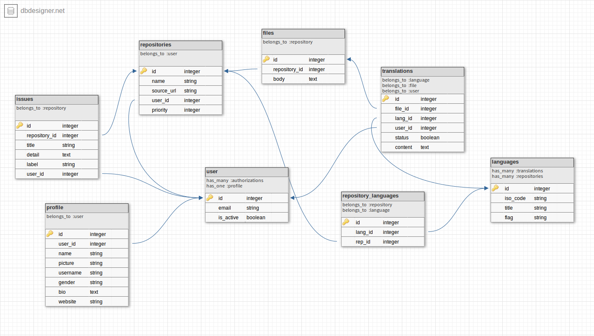

# Çok Kullanıcılı Çeviri Yönetim Sistemi

Güncellenen kaynaklar için çeviri yönetim sistemi

**Ondokuz Mayıs Üniversitesi Özgür Yazılım ve Açık Kaynak Topluluğu**
tarafından yürütülen bir proje!

[

## Tamamlanan Özellikler
 - GitHub'a tam entegrasyon

## Üzerinde Çalışılan Özellikler
 - Kolay kullanılabilir kullanıcı profili

## Eklenecek Özellikler
 - GitHub'daki kaynak repodan doğrudan bilgi çek

 - GitHub'da repo oluştur

 - GitHub reposu ile senkronize çalış

 - Kaynak repodaki değişiklikleri al

 - Kaynak repoya çeviriyi bildiren Issue aç

 - Çeviriyi bir alt dizinde yönet

 - Kaynak metni ilgili başlıklara parçala

 - Her başlık için yeni çeviri dosyası oluştur

 - Çeviriyi yapan kişinin GitHub hesabına bağlan

 - Yapılan çevirileri ilk olarak Kontrol listesine ekle

 - Repo yetkilisinin onayıyla Kontrol listesindeki değişiklikleri kabul et

 - Çeviri yüzdelerini hesapla ve otomatik güncelle

 - Her kullanıcının ne kadar çeviri yaptığını hesapla

 - Çeviri önerileri

 - Bir bölümün birden fazla kişi tarafından çevrilmesi durumunda oylamaya sunulabilmesi

 - API Desteği

## Önyüzde Kullanılan / Kullanılacak Araçlar

- https://adminlte.io/themes/AdminLTE/index2.html

## Araç Seti

- https://github.com/rails/rails

- https://github.com/rmosolgo/graphql-ruby

- https://github.com/piotrmurach/github

- https://github.com/shioyama/mobility

- http://ionicframework.com/docs/intro/installation/
